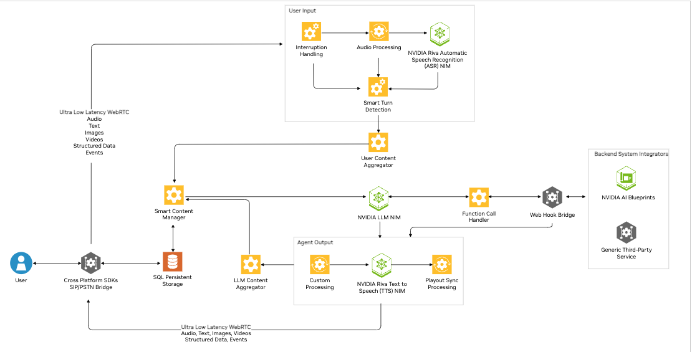

# Voice Agent Framework for Conversational AI

A blueprint notebook showcasing Pipecat AI and NIM in the creation of an AI voice agent. It uses the `meta/llama-3.3-70b-instruct` LLM model and Riva for STT & TTS. This a [launchable on the brev](https://console.brev.dev/launchable/deploy?launchableID=env-2qMHWqvRNPy3P6fKUuQyrJsAiSc) platform.

**[Pipecat AI](https://github.com/pipecat-ai/pipecat)** is an open-source framework for building voice and multimodal conversational agents. Pipecat simplifies the complex voice-to-voice AI pipeline, and lets developers build AI capabilities easily and with Open Source, commercial, and custom models. The framework was developed by [Daily](https://daily.co/), a company that has provided real-time video and audio communication infrastructure since 2016. It is fully vendor neutral and is not tightly coupled to Daily's infrastructure.

Below is the architecture diagram of the system running on brev:


This notebook can be run on brev or on a local machine.

## Run the notebook on brev
Launch from [here](https://console.brev.dev/launchable/deploy?launchableID=env-2qMHWqvRNPy3P6fKUuQyrJsAiSc)

## Run the notebook locally

### Setup JupyterLab
```bash
python3.13 -m venv venv
source venv/bin/activate
pip install -r requirements.txt
python -m ipykernel install --user --name=venv --display-name "Python3.13"
```

### Setup environment
Add NVIDIA API key to `.env`.
```bash
cp example.env .env
# ... edit .env
```

### Run the Jupyter Notebook
```bash
python -m jupyter notebook
```

Navigate to [`http://localhost:8888/notebooks/001-hello-pipecat-nim.ipynb`](http://localhost:8888/notebooks/001-hello-pipecat-nim.ipynb)

### Extras

#### Run in a command line environment
For convenience, a standalone pipecat can be found [here](./001-hello-pipecat-nim.py). Edit the system prompt in a separate file in [./prompts/](./prompts) and then update the [prompt.txt](./prompt.txt) symlink.

```bash
source .env
python3.13 -m venv venv
source venv/bin/activate
pip install "pipecat-ai[daily,openai,riva,silero]" noaa_sdk python-dotenv
python 001-hello-pipecat-nim.py
```

#### Pipecat-AI links and resources

* [Pipecat Repo](https://github.com/pipecat-ai/pipecat)
* [Pipecat docs](https://docs.pipecat.ai)
